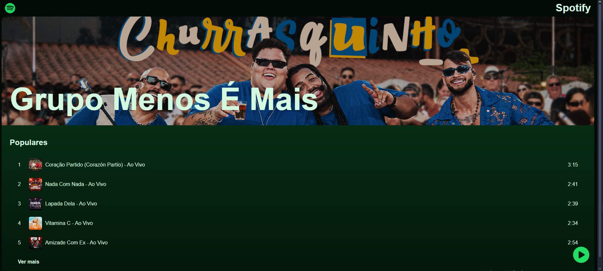
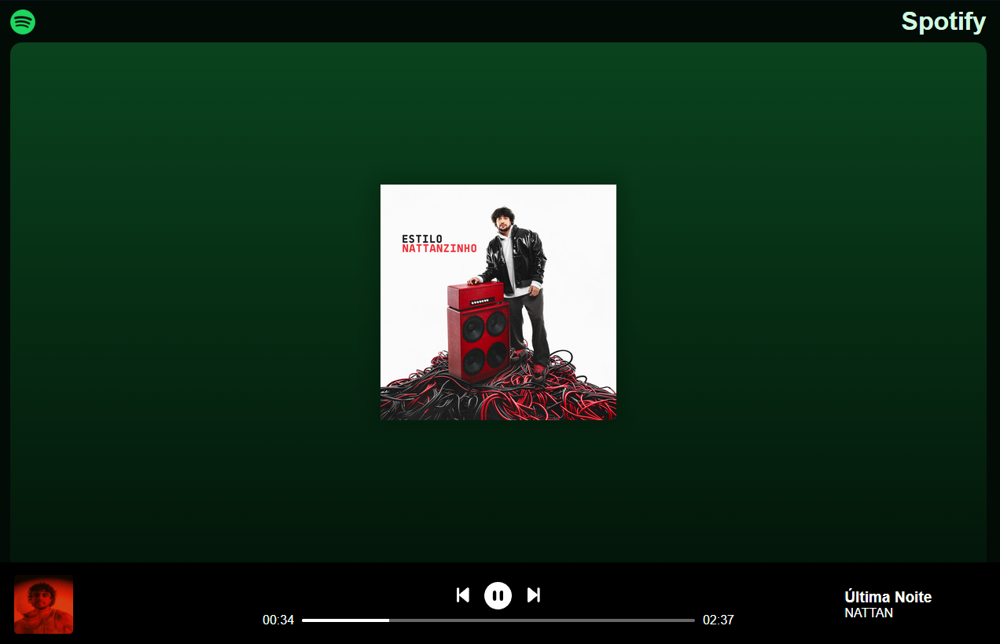
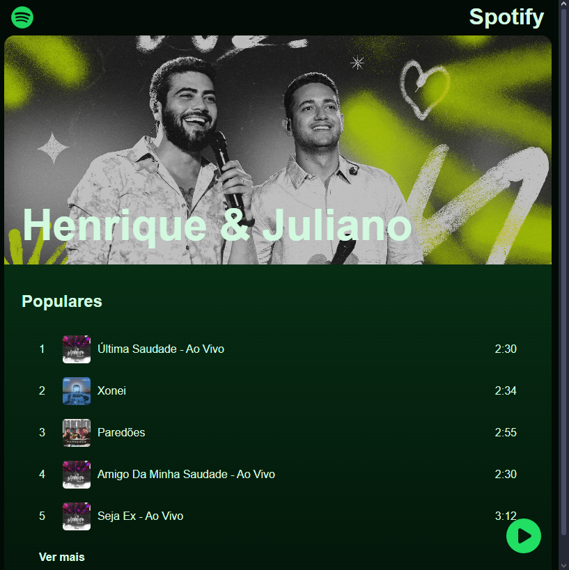
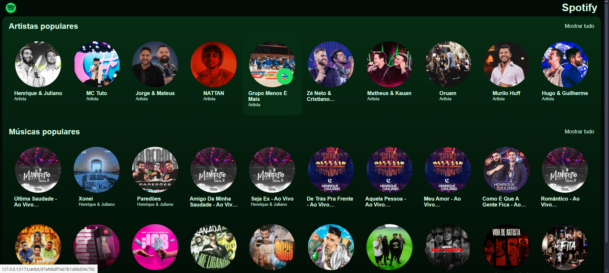

# Spotify Replica

This project was developed as part of Hashtag's Full-Stack Journey, based on the original training repository: https://github.com/fullstackjornada/jornada-full-stack

A full-stack replica of Spotify that provides a basic music browsing and playback experience. Built with **React** for the frontend, **Node.js** with **Express** for the backend, and **MongoDB** as the database, this responsive application allows users to explore a selection of music and play some available tracks.

This project aims to replicate core functionalities of Spotify, focusing on browsing music and artists, with limited playback capabilities.

## Features
- **Browse** a collection of songs and artists
- **Play** some available tracks with an intuitive player











## Technologies Used

### Frontend:
- **React** (19.0.0) - UI Library
- **React Router DOM** (7.1.5) - Client-side routing
- **Axios** (1.7.9) - HTTP requests
- **Vite** (6.1.0) - Build tool

### Backend:
- **Node.js** - JavaScript runtime
- **Express** (4.21.2) - Web framework
- **MongoDB** (6.13.0) - Database
- **CORS** (2.8.5) - Cross-Origin Resource Sharing

## Project Structure

```
spotify-replica/
│── front-end/
│   ├── src/
│   │   ├── components/   # Reusable UI components
│   │   ├── pages/        # Page components
│   │   ├── assets/       # Static files
│   │   ├── App.jsx       # Main App component
│   │   ├── main.jsx      # React entry point
│   │   ├── index.css     # Global styles
│   ├── api               # API calls
│   │   ├── api.js
│   ├── index.html        # HTML entry point
│   ├── package.json      # Dependencies and scripts
│   └── vite.config.js    # Vite configuration
│
│── back-end/
│   ├── api/
│   │   ├── server.js     # Server setup
│   │   ├── connect.js    # Database connection
│   │   ├── insertMany.js # Database seeding script
│   ├── package.json      # Dependencies and scripts
│
└── .env                  # Environment variables
```

## Installation & Setup

### Prerequisites:
- Node.js installed
- MongoDB running

### Clone the repository:
```sh
git clone https://github.com/fornari03/spotify_replica.git
cd spotify-replica
```

### Database Setup
To use this project, you need a **MongoDB database**. If you don’t have a MongoDB account, follow these steps:

1. **Create a MongoDB Account**: Go to [MongoDB Atlas](https://www.mongodb.com/cloud/atlas) and sign up.
2. **Create a Cluster**: Set up a free cluster.
3. **Create a Database**: Once your cluster is ready, create a new database.
4. **Add Collections**: Inside your database, create the following collections:
   - `artists`
   - `songs`


### Set up the environment variables:
Update the `.env` file in the root directory with the actual values from your MongoDB's Cluster and database:
```js
DB_USER=db_user
DB_PASSWORD=db_password
DB_NAME=db_name
```

VITE_PORT is up to you, I recommend 3000 or 3001 if 3000 is already in use.
```js
VITE_PORT=3000
```

### Install dependencies:
#### Frontend:
```sh
cd front-end
npm install
```

#### Backend:
```sh
cd ../back-end
npm install
```

## Running the Project

### Seed the Database:
```sh
cd back-end
npm run seed-database
```

### Start the Backend:
```sh
npm run start:dev
```

### Start the Frontend:
```sh
cd ../front-end
npm run dev
```

## Accessing the Application

Once both the backend and frontend servers are running, you can access the application in your web browser. After you start the frontend, vite will give you informations in the terminal:

```
  VITE v6.1.0  ready in 178 ms

  ➜  Local:   http://localhost:PORT_NUMBER/
  ➜  Network: use --host to expose
  ➜  press h + enter to show help
```
Ctrl + click on `http://localhost:PORT_NUMBER/` to access the application in your browser.

## Contributing
Feel free to submit pull requests or open issues to improve the project.

## License
This project is licensed under the MIT License.

---

Enjoy building and using this Spotify replica! 🎵

